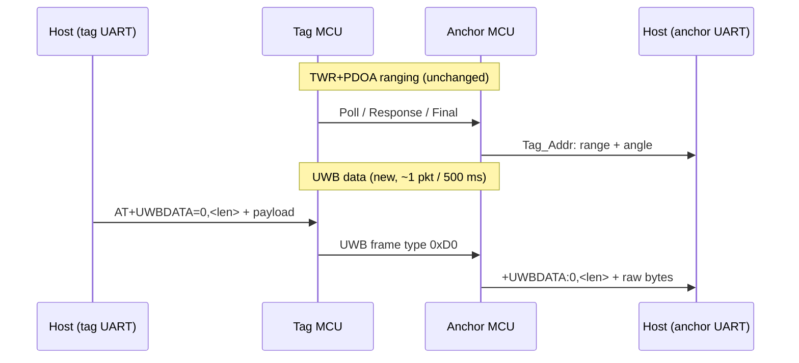

# BU04 UWB Data Transfer (AT+UWBDATA) — Work Summary

**Date:** 2026-05-23  
**Firmware:** V1.0.47 (custom GCC port, builds on working TWR+PDOA V1.0.46)  
**Hardware:** Two Ai-Thinker BU04 modules (STM32F103 + DW3000), anchor `/dev/ttyUSB0`, tag `/dev/ttyUSB4`

---

## Goal

Add a **peer-to-peer UWB data channel** between two BU04 modules, on top of the existing TWR+PDOA ranging stack, with:

- Host upload via a new **AT command**
- Delivery to the host on the opposite module via **standard UART** (`+UWBDATA` notification)
- Payloads up to **~1010 bytes** per packet (1023-byte DW3000 extended frame limit)

---

## Bottom Line

**Firmware and host API implemented; hardware verification pending.**

V1.0.47 adds `AT+UWBDATA` for queueing UWB data frames (message type `0xD0`) while TWR+PDOA ranging continues. The host sends on one serial port; the peer module emits `+UWBDATA:<src>,<len>` followed by raw bytes on its UART.

Test with:

```bash
cd Refs/STM32F103-BU0x_SDK && make flash-all && make reset-all
cd ../..
python3 test_uwbdata.py --anchor /dev/ttyUSB0 --tag /dev/ttyUSB4 --setup --force-setup
```

---

## Background

The vendor AT command set (`BU03_BU04_AT_commands.md`) covers configuration and ranging only — **no data-transfer command**. Internally, `data_tx_msg()` in `Generic_cmd.c` sends telemetry to USB, not UWB peer packets.

The working TWR+PDOA path (`SETUWBMODE=0`, vendor `node.o` / `tag.o`) remains unchanged. Data transfer is an **add-on layer**, not a replacement for ranging.

### DW3000 frame size

| Mode | Max frame size | Max user payload (11-byte header + 2-byte FCS) |
|------|----------------|--------------------------------------------------|
| Standard PHR | 127 B | ~114 B |
| **Extended PHR** | 1023 B | **~1010 B** |

V1.0.47 switches default PHR to **extended** (`DWT_PHRMODE_EXT`) so large data frames fit in one UWB transmission.

---

## Architecture



| Layer | Mechanism |
|-------|-----------|
| UWB frame | 11-byte MAC-style header + type `0xD0` + payload + hardware FCS |
| TX scheduling | Queued on AT; sent from `uwb_data_tick()` in SysTick (~1 packet / 500 ms) |
| RX capture | Non-TWR frame lengths sniffed in `__wrap_process_deca_irq` **before** vendor handler |
| UART upload | `AT+UWBDATA=<dest>,<len>` → `OK` → raw bytes → `OK` |
| UART delivery | `+UWBDATA:<src>,<len>\r\n` + raw bytes + `\r\n` |
| AT during ranging | `App_Module_Process_USART_CMD()` called from SysTick while `uwb_ranging_active` |

---

## AT Protocol

### Send (host → module)

**Small packets (≤32 B)** — single line with hex:

```
AT+UWBDATA=<dest>,<len>,<hexpayload>
OK
```

**Large packets (33–1010 B)** — header + binary body:

```
AT+UWBDATA=<dest>,<len>
OK
<len bytes raw binary>
OK
```

- `<dest>`: destination node address (`0` for the standard two-module setup with both `id=0`)
- `<len>`: payload length in bytes (1–1010)

### Receive (module → host)

```
+UWBDATA:<src>,<len>
<len bytes raw binary>

```

- `<src>`: sender node address from the UWB frame header
- Payload is **binary**, not hex (keeps large packets practical on UART)

---

## Host API (`bu04_at.py`)

| Symbol / method | Purpose |
|-----------------|---------|
| `UWBDATA_MAX_PAYLOAD` | 1010 |
| `UWBDATA_INLINE_MAX` | 32 (hex inline threshold) |
| `Bu04Device.send_uwbdata(dest, payload)` | Queue packet on module |
| `Bu04Device.read_uwbdata(duration)` | Non-blocking parse of `+UWBDATA` |
| `Bu04Device.wait_uwbdata(timeout)` | Block until one packet arrives |

Example:

```python
from bu04_at import Bu04Device

with Bu04Device("/dev/ttyUSB4") as tag, Bu04Device("/dev/ttyUSB0") as anchor:
    tag.send_uwbdata(dest=0, payload=b"hello")
    src, data = anchor.wait_uwbdata(timeout=15.0)
```

---

## Test Script (`test_uwbdata.py`)

Automated bidirectional test:

1. Checks firmware ≥ V1.0.47
2. Optional `--setup` (roles + PDOA + `AT+UWBSTART`)
3. Sends small inline payload, medium binary-upload payload (40 B), optional `--size N`
4. Verifies byte-for-byte match on receiver

```bash
# First run after flash
python3 test_uwbdata.py --anchor /dev/ttyUSB0 --tag /dev/ttyUSB4 --setup --force-setup

# Subsequent runs (roles already in NVM)
python3 test_uwbdata.py --anchor /dev/ttyUSB0 --tag /dev/ttyUSB4 --skip-setup

# Large payload
python3 test_uwbdata.py --skip-setup --size 512 --direction tag2anchor
```

---

## Firmware Changes (V1.0.46 → V1.0.47)

| File | Change |
|------|--------|
| `Components/APP/uwb_data.c` | **New** — frame build, TX queue, RX buffer, UART upload/delivery |
| `Components/APP/uwb_data.h` | **New** — public API and limits |
| `Components/APP/cmd_fn.c` | `f_uwbdata()` handler; register `AT+UWBDATA`; call `uwb_data_init()` in `f_uwbstart` |
| `Components/APP/uwb_status.c` | Capture type `0xD0` frames before `__real_process_deca_irq()` (non-13/21/110 lengths only) |
| `Components/APP/Generic_cmd.c` | Binary UART feed after `AT+UWBDATA=<dest>,<len>` |
| `Components/APP/Generic.c` | `uwb_data_init()` at boot |
| `Components/Main/stm32f10x_it.c` | SysTick: `App_Module_Process_USART_CMD()` + `uwb_data_tick()` during ranging |
| `Components/HAL/DW/twr_pdoa/inc/default_config.h` | `DEFAULT_PHRMODE` → `DWT_PHRMODE_EXT` |
| `Components/APP/Generic.h` | Version `V1.0.47` |
| `Makefile` | Added `uwb_data.c` to build |

### UWB data frame layout

| Offset | Field |
|--------|-------|
| 0–1 | Frame control `0x41 0x88` |
| 2 | Sequence |
| 3–4 | PAN ID (from PDOA config, typically `0x1111`) |
| 5–6 | Destination address |
| 7–8 | Source address |
| 9 | Reserved `0x00` |
| 10 | Message type `0xD0` |
| 11+ | User payload |

### Design constraints

1. **One TX packet queued at a time** — second `AT+UWBDATA` returns ERR if queue full
2. **TX rate ~2 Hz max** — 500 ms minimum between UWB data transmissions to limit impact on TWR timing
3. **RX before vendor handler** — only for non-TWR frame lengths; TWR Poll/Response/Final paths untouched (same lesson as PDOA fixes in V1.0.46)
4. **Bidirectional** — both anchor and tag can send; use `<dest>=0` when both modules use `id=0`

---

## Prerequisites

Same as working TWR+PDOA setup (see `BU04_pdoa_achievements.md`):

- Both modules `id=0` (not 17845/0x45B5)
- Anchor `role=1`, tag `role=0`
- `AT+SETUWBMODE=0`, PDOA network 4369, `AT+ADDTAG`, `AT+UWBSTART`
- Flash erases NVM — use `--force-setup` or full SETCFG after `make flash-all`

---

## Operational Notes

1. **Flash V1.0.47** before testing — `AT+UWBDATA` does not exist on V1.0.46
2. **UWB must be running** — data TX is attempted only when `uwb_ranging_active=1` (after `AT+UWBSTART`)
3. **Expect latency** — queued packets transmit on the next 500 ms tick; allow 5–20 s in tests for first packet
4. **Monitor TWR/PDOA** — if `send resp fault` rises or `Tag_Addr` stops, reduce data rate or pause transfers
5. **Extended PHR** — applies to all frames after V1.0.47; TWR Final (110 B) still fits; re-verify ranging after flash

---

## Related Docs

| File | Content |
|------|---------|
| `BU04_pdoa_achievements.md` | TWR+PDOA ranging (prerequisite) |
| `BU04_distance_achievements.md` | TWR-only milestone |
| `BU03_BU04_AT_commands.md` | Vendor AT reference (no UWBDATA — custom extension) |
| `bu04_at.py` | Host AT wrapper + `send_uwbdata` / `wait_uwbdata` |
| `test_uwbdata.py` | Automated link test |

---

## Remaining / Optional Work

| Item | Notes |
|------|-------|
| Hardware verification | Run `test_uwbdata.py` on physical pair; confirm no TWR regression |
| Throughput | Currently ~1 pkt / 500 ms; could use superframe gaps more aggressively |
| Queue depth | Single-slot queue; ring buffer if host sends faster than UWB TX |
| ACK / retry | No link-layer ACK yet; host must timeout and retry |
| Hex receive option | Could add `+UWBDATA:<src>,<len>,<hex>` for tiny payloads if binary parsing is awkward |
| Docs in vendor AT PDF | `AT+UWBDATA` is a custom extension, not in Ai-Thinker PDF v1.0.6 |

---

*Built from custom GCC firmware in `Refs/STM32F103-BU0x_SDK`. Vendor TWR stack: `node.o`, `tag.o` (unchanged).*
